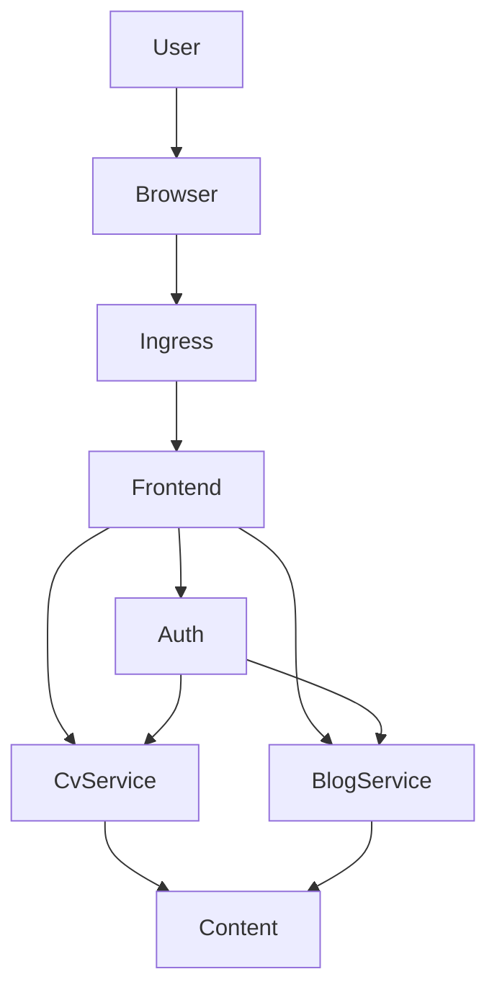
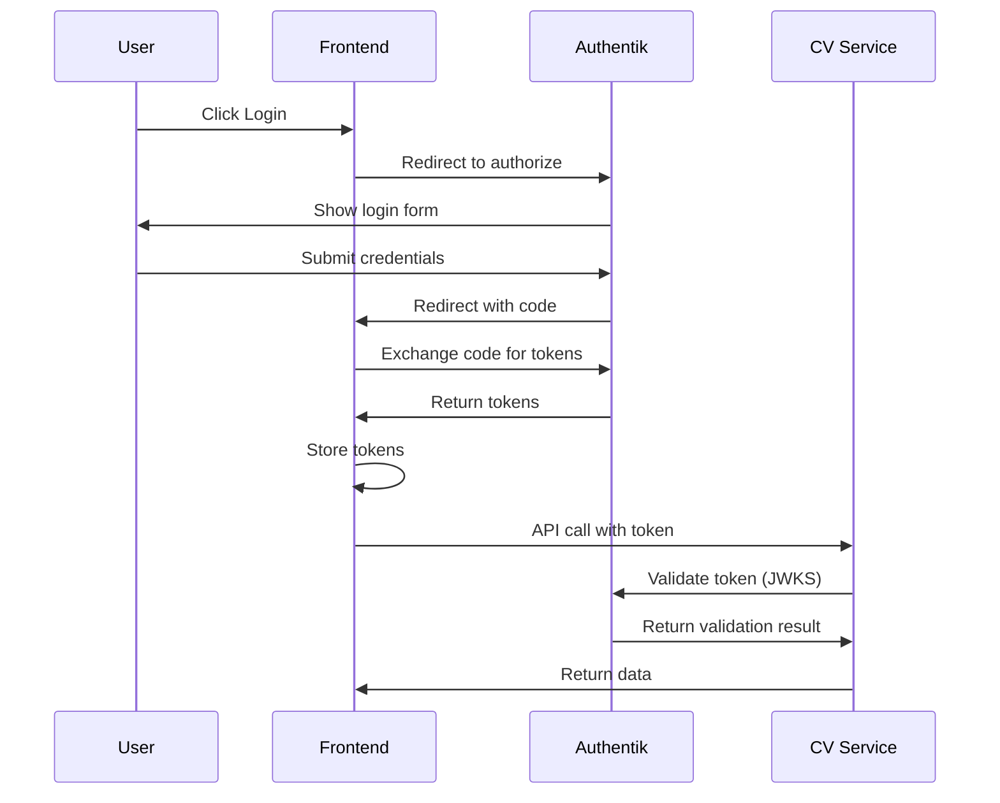

# Architecture Documentation

## System Overview

The VPS platform is a microservices-based application deployed on k3s (lightweight Kubernetes) with centralized authentication via Authentik.

## Architecture Diagram



## Components

### Frontend (Next.js)
- **Purpose**: User-facing web application
- **Tech**: Next.js 14, React, TypeScript, Tailwind CSS
- **Responsibilities**:
  - Serve CV content
  - Display blog posts
  - Provide tools placeholder page
  - Handle authentication flow

### CV Service (Go)
- **Purpose**: Serve CV data from YAML/markdown
- **Tech**: Go, Gorilla Mux
- **Responsibilities**:
  - Parse CV YAML
  - Serve CV as JSON
  - Validate JWT tokens

### Blog Service (Python/FastAPI)
- **Purpose**: Serve blog posts from markdown
- **Tech**: Python, FastAPI, python-jose
- **Responsibilities**:
  - Parse markdown posts
  - Render markdown to HTML
  - Provide pagination
  - Tag filtering
  - Draft post protection

### Authentik
- **Purpose**: Centralized authentication
- **Tech**: Python, OIDC provider
- **Responsibilities**:
  - OIDC authentication
  - User management
  - Token issuance
  - JWKS endpoint

### Content Repository
- **Purpose**: Manage CV and blog content
- **Tech**: Git repository
- **Responsibilities**:
  - Store CV YAML files
  - Store blog markdown posts
  - Version control for content
  - Pulled into cluster via git-sync

## Authentication Flow



## Token Structure

### Access Token (JWT)
```json
{
  "sub": "user-id",
  "aud": ["vps-cv-api"],
  "iss": "https://auth.domain.com/application/o/vps-platform/",
  "exp": 1700000000,
  "iat": 1699996400,
  "name": "Fakhrur Razi",
  "email": "user@example.com",
  "groups": ["admin"],
  "roles": ["cv:write", "blog:write"],
  "scope": ["cv:read"]
}
```

## Data Flow

### CV Data
1. CV content in YAML stored in content repo
2. git-sync pulls repo into CV service pod
3. CV service parses YAML and serves as JSON
4. Frontend fetches and displays

### Blog Posts
1. Blog posts in markdown with frontmatter in content repo
2. git-sync pulls repo into blog service pod
3. Blog service parses markdown + frontmatter
4. Renders HTML and serves via API
5. Frontend displays with markdown styling

## Infrastructure

### k3s
- Single-node Kubernetes cluster
- Includes Traefik ingress controller
- Built-in service load balancer

### Traefik (Ingress)
- Handles external traffic
- TLS termination
- Routes to services based on Host/Path

### cert-manager
- Automatic Let's Encrypt certificate management
- Creates SSL/TLS certificates

### Argo CD
- GitOps deployment
- Continuous sync from Git repo
- Application management

## Security Considerations

1. **JWT Validation**: All services validate tokens using JWKS
2. **TLS Everywhere**: All services use HTTPS
3. **Network Policies**: Isolate services (future enhancement)
4. **Secrets Management**: Use Kubernetes secrets, consider Sealed-Secrets
5. **Input Validation**: All services validate and sanitize inputs

## Extensibility

Adding new services is simplified through the service template:

1. Use Python/FastAPI template from `templates/`
2. Customize for your use case
3. Deploy with provided Kubernetes manifest template
4. Configure in Authentik for scopes/roles

### Service Template Features
- JWT authentication built-in
- Health check endpoints
- Configuration management
- Error handling patterns
- Deployment-ready manifests
- CI/CD workflow templates

See the services repo templates README for detailed template usage (this workspace: `../../services/templates/README.md`).

## Scaling Considerations

### Vertical Scaling
- Increase CPU/memory limits on deployments
- Particularly useful for CPU-intensive services

### Horizontal Scaling
- Add replicaCount for services
- Horizontal Pod Autoscaler (HPA)
- Currently limited by single VPS

## Monitoring & Observability

### Current
- kubectl logs for debugging
- Pod status metrics
- Service availability

### Recommended (Future)
- Prometheus + Grafana for metrics
- Loki for log aggregation
- Alertmanager for alerts
- Tracing with Jaeger

## Backup Strategy

### Content Repo
- Git provides version control
- Mirror to multiple remotes
- No additional backup needed

### Config
- All config in Git (GitOps)
- Secrets need separate backup
- Use Sealed-Secrets for Git-storable secrets